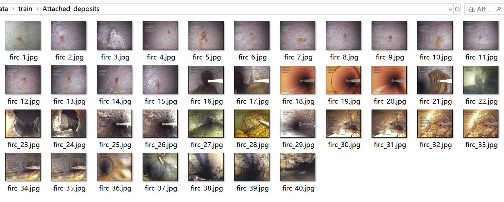
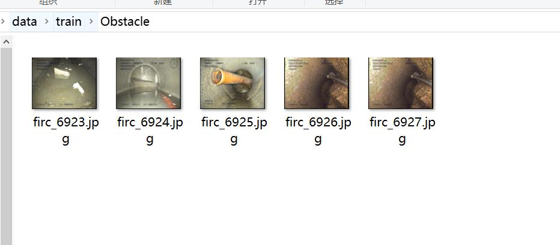

# Pipeline Inspection Data Set for Underground Pipe Defects with 9085 Images and 219 Categories

Dataset type: Image classification for use, not suitable for target detection with annotation files.
Dataset format: Only contains JPG images, each class folder is stored with corresponding images.
number of images: 9085  
number of classes: 219  
category names:['Attached-deposits','Attached-deposits Branch-pipe Chiseled-connection Displaced-joint Settled-deposits','Attached-deposits Branch-pipe Chiseled-connection Displaced-joint Settled-deposits Surface-damage','Attached-deposits Branch-pipe Construction-changes Cracks-breaks-and-collapses Displaced-joint Settled-deposits Surface-damage','Attached-deposits Branch-pipe Cracks-breaks-and-collapses Displaced-joint','Attached-deposits Branch-pipe Cracks-breaks-and-collapses Displaced-joint Settled-deposits Surface-damage','Attached-deposits Branch-pipe Cracks-breaks-and-collapses Displaced-joint Surface-damage','Attached-deposits Branch-pipe Cracks-breaks-and-collapses Surface-damage','Attached-deposits Branch-pipe Displaced-joint','Attached-deposits Branch-pipe Displaced-joint Intruding-sealing-material','Attached-deposits Branch-pipe Displaced-joint Settled-deposits','Attached-deposits Branch-pipe Displaced-joint Settled-deposits Surface-damage','Attached-deposits Branch-pipe Displaced-joint Surface-damage','Attached-deposits Branch-pipe Settled-deposits','Attached-deposits Chiseled-connection Cracks-breaks-and-collapses Displaced-joint Settled-deposits','Attached-deposits Chiseled-connection Cracks-breaks-and-collapses Displaced-joint Settled-deposits Surface-damage','Attached-deposits Chiseled-connection Cracks-breaks-and-collapses Displaced-joint Surface-damage','Attached-deposits Chiseled-connection Cracks-breaks-and-collapses Settled-deposits Surface-damage','Attached-deposits Chiseled-connection Cracks-breaks-and-collapses Surface-damage','Attached-deposits Chiseled-connection Displaced-joint','Attached-deposits Chiseled-connection Displaced-joint Settled-deposits','Attached-deposits Chiseled-connection Displaced-joint Settled-deposits Surface-damage','Attached-deposits Chiseled-connection Displaced-joint Surface-damage','Attached-deposits Chiseled-connection Surface-damage','Attached-deposits Construction-changes','Attached-deposits Construction-changes Cracks-breaks-and-collapses Displaced-joint','Attached-deposits Construction-changes Cracks-breaks-and-collapses Displaced-joint Roots','Attached-deposits Construction-changes Cracks-breaks-and-collapses Displaced-joint Settled-deposits','Attached-deposits Construction-changes Cracks-breaks-and-collapses Displaced-joint Surface-damage','Attached-deposits Construction-changes Displaced-joint','Attached-deposits Construction-changes Displaced-joint Roots','Attached-deposits Construction-changes Displaced-joint Settled-deposits','Attached-deposits Construction-changes Displaced-joint Surface-damage','Attached-deposits Construction-changes Obstacle Settled-deposits Surface-damage','Attached-deposits Construction-changes Settled-deposits','Attached-deposits Construction-changes Surface-damage','Attached-deposits Cracks-breaks-and-collapses','Attached-deposits Cracks-breaks-and-collapses Displaced-joint','Attached-deposits Cracks-breaks-and-collapses Displaced-joint Intruding-sealing-material Surface-damage','Attached-deposits Cracks-breaks-and-collapses Displaced-joint Settled-deposits','Attached-deposits Cracks-breaks-and-collapses Displaced-joint Settled-deposits Surface-damage','Attached-deposits Cracks-breaks-and-collapses Displaced-joint Surface-damage','Attached-deposits Cracks-breaks-and-collapses Obstacle Settled-deposits Surface-damage','Attached-deposits Cracks-breaks-and-collapses Obstacle Surface-damage','Attached-deposits Deformation','Attached-deposits Deformation Displaced-joint','Attached-deposits Displaced-joint','Attached-deposits Displaced-joint Infiltration Surface-damage','Attached-deposits Displaced-joint Intruding-sealing-material','Attached-deposits Displaced-joint Intruding-sealing-material Settled-deposits','Attached-deposits Displaced-joint Intruding-sealing-material Surface-damage','Attached-deposits Displaced-joint Obstacle Surface-damage','Attached-deposits Displaced-joint Roots Surface-damage','Attached-deposits Displaced-joint Settled-deposits','Attached-deposits Displaced-joint Settled-deposits Surface-damage','Attached-deposits Displaced-joint Surface-damage','Attached-deposits Drilled-connection','Attached-deposits Infiltration Lateral-reinstatement-cuts','Attached-deposits Infiltration Surface-damage','Attached-deposits Lateral-reinstatement-cuts','Attached-deposits Obstacle Settled-deposits Surface-damage','Attached-deposits Obstacle Surface-damage','Attached-deposits Production-error','Attached-deposits Production-error Settled-deposits','Attached-deposits Settled-deposits','Attached-deposits Settled-deposits Surface-damage','Attached-deposits Surface-damage','Branch-pipe','Branch-pipe Chiseled-connection Displaced-joint','Branch-pipe Chiseled-connection Displaced-joint Surface-damage','Branch-pipe Construction-changes','Branch-pipe Construction-changes Cracks-breaks-and-collapses','Branch-pipe Construction-changes Cracks-breaks-and-collapses Displaced-joint','Branch-pipe Construction-changes Cracks-breaks-and-collapses Displaced-joint Roots','Branch-pipe Construction-changes Cracks-breaks-and-collapses Displaced-joint Roots Settled-deposits','Branch-pipe Construction-changes Cracks-breaks-and-collapses Displaced-joint Roots Surface-damage','Branch-pipe Construction-changes Cracks-breaks-and-collapses Displaced-joint Settled-deposits','Branch-pipe Construction-changes Cracks-breaks-and-collapses Displaced-joint Surface-damage','Branch-pipe Construction-changes Cracks-breaks-and-collapses Roots Surface-damage','Branch-pipe Construction-changes Deformation','Branch-pipe Construction-changes Displaced-joint','Branch-pipe Construction-changes Displaced-joint Settled-deposits','Branch-pipe Construction-changes Displaced-joint Surface-damage','Branch-pipe Cracks-breaks-and-collapses','Branch-pipe Cracks-breaks-and-collapses Displaced-joint Roots','Branch-pipe Cracks-breaks-and-collapses Displaced-joint Roots Surface-damage','Branch-pipe Cracks-breaks-and-collapses Displaced-joint Settled-deposits','Branch-pipe Cracks-breaks-and-collapses Displaced-joint Settled-deposits Surface-damage','Branch-pipe Cracks-breaks-and-collapses Displaced-joint Surface-damage','Branch-pipe Cracks-breaks-and-collapses Settled-deposits','Branch-pipe Deformation','Branch-pipe Deformation Production-error','Branch-pipe Displaced-joint','Branch-pipe Displaced-joint Intruding-sealing-material','Branch-pipe Displaced-joint Intruding-sealing-material Surface-damage','Branch-pipe Displaced-joint Roots','Branch-pipe Displaced-joint Roots Surface-damage','Branch-pipe Displaced-joint Settled-deposits','Branch-pipe Displaced-joint Settled-deposits Surface-damage','Branch-pipe Displaced-joint Surface-damage','Branch-pipe Settled-deposits','Branch-pipe Surface-damage','Chiseled-connection','Chiseled-connection Construction-changes','Chiseled-connection Construction-changes Cracks-breaks-and-collapses Displaced-joint Obstacle Settled-deposits Surface-damage','Chiseled-connection Construction-changes Cracks-breaks-and-collapses Displaced-joint Roots','Chiseled-connection Construction-changes Displaced-joint','Chiseled-connection Construction-changes Displaced-joint Roots Surface-damage','Chiseled-connection Construction-changes Surface-damage','Chiseled-connection Cracks-breaks-and-collapses','Chiseled-connection Cracks-breaks-and-collapses Displaced-joint','Chiseled-connection Cracks-breaks-and-collapses Displaced-joint Roots','Chiseled-connection Cracks-breaks-and-collapses Displaced-joint Roots Surface-damage','Chiseled-connection Cracks-breaks-and-collapses Displaced-joint Settled-deposits','Chiseled-connection Cracks-breaks-and-collapses Displaced-joint Settled-deposits Surface-damage','Chiseled-connection Cracks-breaks-and-collapses Displaced-joint Surface-damage','Chiseled-connection Displaced-joint','Chiseled-connection Displaced-joint Intruding-sealing-material Settled-deposits Surface-damage','Chiseled-connection Displaced-joint Lateral-reinstatement-cuts Surface-damage','Chiseled-connection Displaced-joint Roots Surface-damage','Chiseled-connection Displaced-joint Settled-deposits','Chiseled-connection Displaced-joint Settled-deposits Surface-damage','Chiseled-connection Displaced-joint Surface-damage','Chiseled-connection Surface-damage','Construction-changes','Construction-changes Cracks-breaks-and-collapses','Construction-changes Cracks-breaks-and-collapses Displaced-joint','Construction-changes Cracks-breaks-and-collapses Displaced-joint Intruding-sealing-material Surface-damage','Construction-changes Cracks-breaks-and-collapses Displaced-joint Obstacle','Construction-changes Cracks-breaks-and-collapses Displaced-joint Obstacle Surface-damage','Construction-changes Cracks-breaks-and-collapses Displaced-joint Roots Settled-deposits','Construction-changes Cracks-breaks-and-collapses Displaced-joint Roots Surface-damage','Construction-changes Cracks-breaks-and-collapses Displaced-joint Settled-deposits','Construction-changes Cracks-breaks-and-collapses Displaced-joint Settled-deposits Surface-damage','Construction-changes Cracks-breaks-and-collapses Displaced-joint Surface-damage','Construction-changes Cracks-breaks-and-collapses Settled-deposits','Construction-changes Cracks-breaks-and-collapses Settled-deposits Surface-damage','Construction-changes Deformation','Construction-changes Deformation Displaced-joint','Construction-changes Deformation Displaced-joint Surface-damage','Construction-changes Displaced-joint','Construction-changes Displaced-joint Intruding-sealing-material','Construction-changes Displaced-joint Intruding-sealing-material Settled-deposits','Construction-changes Displaced-joint Intruding-sealing-material Surface-damage','Construction-changes Displaced-joint Obstacle','Construction-changes Displaced-joint Obstacle Surface-damage','Construction-changes Displaced-joint Production-error','Construction-changes Displaced-joint Roots','Construction-changes Displaced-joint Roots Settled-deposits','Construction-changes Displaced-joint Roots Settled-deposits Surface-damage','Construction-changes Displaced-joint Roots Surface-damage','Construction-changes Displaced-joint Settled-deposits','Construction-changes Displaced-joint Settled-deposits Surface-damage','Construction-changes Displaced-joint Surface-damage','Construction-changes Production-error','Construction-changes Roots','Construction-changes Roots Surface-damage','Construction-changes Settled-deposits','Construction-changes Settled-deposits Surface-damage','Construction-changes Surface-damage','Cracks-breaks-and-collapses','Cracks-breaks-and-collapses Deformation Displaced-joint Surface-damage','Cracks-breaks-and-collapses Displaced-joint','Cracks-breaks-and-collapses Displaced-joint Infiltration','Cracks-breaks-and-collapses Displaced-joint Intruding-sealing-material','Cracks-breaks-and-collapses Displaced-joint Intruding-sealing-material Settled-deposits','Cracks-breaks-and-collapses Displaced-joint Intruding-sealing-material Surface-damage','Cracks-breaks-and-collapses Displaced-joint Obstacle','Cracks-breaks-and-collapses Displaced-joint Roots','Cracks-breaks-and-collapses Displaced-joint Roots Settled-deposits','Cracks-breaks-and-collapses Displaced-joint Roots Settled-deposits Surface-damage','Cracks-breaks-and-collapses Displaced-joint Roots Surface-damage','Cracks-breaks-and-collapses Displaced-joint Settled-deposits','Cracks-breaks-and-collapses Displaced-joint Settled-deposits Surface-damage','Cracks-breaks-and-collapses Displaced-joint Surface-damage','Cracks-breaks-and-collapses Drilled-connection','Cracks-breaks-and-collapses Drilled-connection Settled-deposits','Cracks-breaks-and-collapses Obstacle','Cracks-breaks-and-collapses Roots Surface-damage','Cracks-breaks-and-collapses Settled-deposits','Cracks-breaks-and-collapses Surface-damage','Deformation','Deformation Displaced-joint','Deformation Displaced-joint Production-error','Deformation Displaced-joint Surface-damage','Deformation Intruding-sealing-material','Deformation Production-error','Displaced-joint','Displaced-joint Intruding-sealing-material','Displaced-joint Intruding-sealing-material Roots Settled-deposits Surface-damage','Displaced-joint Intruding-sealing-material Roots Surface-damage','Displaced-joint Intruding-sealing-material Settled-deposits','Displaced-joint Intruding-sealing-material Surface-damage','Displaced-joint Obstacle','Displaced-joint Obstacle Settled-deposits','Displaced-joint Obstacle Surface-damage','Displaced-joint Roots','Displaced-joint Roots Settled-deposits','Displaced-joint Roots Settled-deposits Surface-damage','Displaced-joint Roots Surface-damage','Displaced-joint Settled-deposits','Displaced-joint Settled-deposits Surface-damage','Displaced-joint Surface-damage','Drilled-connection','Drilled-connection Surface-damage','Intruding-sealing-material','Intruding-sealing-material Roots Surface-damage','Intruding-sealing-material Surface-damage','Lateral-reinstatement-cuts','Lateral-reinstatement-cuts Production-error','Null','Obstacle','Production-error','Roots','Roots Settled-deposits Surface-damage','Roots Surface-damage','Settled-deposits','Settled-deposits Surface-damage','Surface-damage']  
images per class:   
training set image count: 7088  
- Attached-depositstraining set image count: 40  
- Attached-deposits Branch-pipe Chiseled-connection Displaced-joint Settled-depositstraining set image count: 2  
- Attached-deposits Branch-pipe Chiseled-connection Displaced-joint Settled-deposits Surface-damagetraining set image count: 1  
- Attached-deposits Branch-pipe Construction-changes Cracks-breaks-and-collapses Displaced-joint Settled-deposits Surface-damagetraining set image count: 3  
- Attached-deposits Branch-pipe Cracks-breaks-and-collapses Displaced-jointtraining set image count: 1  
- Attached-deposits Branch-pipe Cracks-breaks-and-collapses Displaced-joint Settled-deposits Surface-damagetraining set image count: 1  
- Attached-deposits Branch-pipe Cracks-breaks-and-collapses Displaced-joint Surface-damagetraining set image count: 2  
- Attached-deposits Branch-pipe Cracks-breaks-and-collapses Surface-damagetraining set image count: 1  
- Deposits Branch Pipe Displacement Joint Training set image count: 6  
- Deposits Branch Pipe Displacement Joint Intrusion Sealing Material Training set image count: 2  
- Deposits Branch Pipe Displacement Joint Settled Deposits Training set image count: 11  
- Deposits Branch Pipe Displacement Joint Settled Deposits Surface Damage Training set image count: 6  
- Deposits Branch Pipe Displacement Joint Surface Damage Training set image count: 12  
- Deposits Branch Pipe Settled Deposits Training set image count: 1  
- Deposits Chiseled Connection Cracks Breaks and Collapses Displaced Joint Settled Deposits Training set image count: 3  
- Deposits Chiseled Connection Cracks Breaks and Collapses Displaced Joint Settled Deposits Surface Damage Training set image count: 3  
- Deposits Chiseled Connection Cracks Breaks and Collapses Displaced Joint Surface Damage Training set image count: 16  
- Deposits Chiseled Connection Cracks Breaks and Collapses Settled Deposits Surface Damage Training set image count: 3  
- Deposits Chiseled Connection Cracks Breaks and Collapses Surface Damage Training set image count: 2  
- Deposits Chiseled Connection Displaced Joint Training set image count: 13  
- Deposits Chiseled Connection Displaced Joint Settled Deposits Training set image count: 5  
- Deposits Chiseled Connection Displaced Joint Settled Deposits Surface Damage Training set image count: 6  
- Deposits Chiseled Connection Displaced Joint Surface Damage Training set image count: 21
- Attached-deposits Chiseled-connection Surface-damagetraining set image count: 1  
- Attached-deposits Construction-changestraining set image count: 4  
- Attached-deposits Construction-changes Cracks-breaks-and-collapses Displaced-jointtraining set image count: 3  
- Attached-deposits Construction-changes Cracks-breaks-and-collapses Displaced-joint Rootstraining set image count: 1  
- Attached-deposits Construction-changes Cracks-breaks-and-collapses Displaced-joint Settled-depositstraining set image count: 2  
- Attached-deposits Construction-changes Cracks-breaks-and-collapses Displaced-joint Surface-damagetraining set image count: 1  
- Attached-deposits Construction-changes Displaced-jointtraining set image count: 20  
- Attached-deposits Construction-changes Displaced-joint Rootstraining set image count: 2  
- Attached-deposits Construction-changes Displaced-joint Settled-depositstraining set image count: 4  
- Attached-deposits Construction-changes Displaced-joint Surface-damagetraining set image count: 18  
- Attached-deposits Construction-changes Obstacle Settled-deposits Surface-damagetraining set image count: 1  
- Attached-deposits Construction-changes Settled-depositstraining set image count: 1  
- Attached-deposits Construction-changes Surface-damagetraining set image count: 2  
- Attached-deposits Cracks-breaks-and-collapsestraining set image count: 1  
- Attached-deposits Cracks-breaks-and-collapses Displaced-jointtraining set image count: 5  
- Attached-deposits Cracks-breaks-and-collapses Displaced-joint Intruding-sealing-material Surface-damagetraining set image count: 3  
- Attached-deposits Cracks-breaks-and-collapses Displaced-joint Settled-depositstraining set image count: 4  
- Attached-deposits Cracks-breaks-and-collapses Displaced-joint Settled-deposits Surface-damagetraining set image count: 4  
- Attached-deposits Cracks-breaks-and-collapses Displaced-joint Surface-damagetraining set image count: 23  
- Attached-deposits Cracks-breaks-and-collapses Obstacle Settled-deposits Surface-damagetraining set image count: 2  
- Attached-deposits Cracks-breaks-and-collapses Obstacle Surface-damagetraining set image count: 2  
- Attached-deposits Deformationtraining set image count: 2  
- Attached-deposits Deformation Displaced-jointtraining set image count: 2  
- Attached-deposits Displaced-jointtraining set image count: 72  
- Attached-deposits Displaced-joint Infiltration Surface-damagetraining set image count: 1  
- Attached-deposits Displaced-joint Intruding-sealing-materialtraining set image count: 10  
- Attached-deposits Displaced-joint Intruding-sealing-material Settled-depositstraining set image count: 2  
- Attached-deposits Displaced-joint Intruding-sealing-material Surface-damagetraining set image count: 2  
- Attached-deposits Displaced-joint Obstacle Surface-damagetraining set image count: 3  
- Attached-deposits Displaced-joint Roots Surface-damagetraining set image count: 4  
- Deposits attached - Displaced - Joint settled deposits training set image count: 41
- Attached-deposits Displaced-joint Settled-deposits Surface-damagetraining set image count: 17  
- Attached-deposits Displaced-joint Surface-damagetraining set image count: 102  
- Attached-deposits Drilled-connectiontraining set image count: 7  
- Attached-deposits Infiltration Lateral-reinstatement-cutstraining set image count: 4  
- Attached-deposits Infiltration Surface-damagetraining set image count: 2  
- Attached deposits Lateral-reinstatement-cuts Training set image count: 5
- Attached-deposits Obstacle Settled-deposits Surface-damagetraining set image count: 1  
- Attached-deposits Obstacle Surface-damagetraining set image count: 4  
- Attached-deposits Production-errortraining set image count: 55  
- Attached-deposits Production-error Settled-deposits training set image count: 4.
- Attached-deposits Settled-deposits Training set image count: 3
- Deposits Attached
- Settled Deposits
- Surface Damage
- Attached-deposits Surface-damagetraining set image count: 13  
- Branch-pipetraining set image count: 49  
- Training set images for Branch-pipe Chiseled-connection Displaced-joint: 2  
- Training set images for Branch-pipe Chiseled-connection Displaced-joint Surface-damage: 7  
- Training set images for Branch-pipe Construction-changes: 13  
- Training set images for Branch-pipe Construction-changes Cracks-breaks-and-collapses: 2  
- Training set images for Branch-pipe Construction-changes Cracks-breaks-and-collapses Displaced-joint: 2  
- Training set images for Branch-pipe Construction-changes Cracks-breaks-and-collapses Displaced-joint Roots: 2  
- Training set images for Branch-pipe Construction-changes Cracks-breaks-and-collapses Displaced-joint Roots Settled-deposits: 1  
- Training set images for Branch-pipe Construction-changes Cracks-breaks-and-collapses Displaced-joint Roots Surface-damage: 1  
- Training set images for Branch-pipe Construction-changes Cracks-breaks-and-collapses Displaced-joint Settled-deposits: 1  
- Training set images for Branch-pipe Construction-changes Cracks-breaks-and-collapses Displaced-joint Surface-damage: 1  
- Training set images for Branch-pipe Construction-changes Cracks-breaks-and-collapses Roots Surface-damage: 1  
- Training set images for Branch-pipe Construction-changes Deformation: 2  
- Training set images for Branch-pipe Construction-changes Displaced-joint: 14  
- Training set images for Branch-pipe Construction-changes Displaced-joint Settled-deposits: 2  
- Training set images for Branch-pipe Construction-changes Displaced-joint Surface-damage: 2
- Branch-pipe Cracks-breaks-and-collapses training set image count: 1  
- Branch-pipe Cracks-breaks-and-collapses Displaced-joint Roots training set image count: 1  
- Branch-pipe Cracks-breaks-and-collapses Displaced-joint Roots Surface-damage training set image count: 1  
- Branch-pipe Cracks-breaks-and-collapses Displaced-joint Settled-deposits training set image count: 4  
- Branch-pipe Cracks-breaks-and-collapses Displaced-joint Settled-deposits Surface-damage training set image count: 3  
- Branch-pipe Cracks-breaks-and-collapses Displaced-joint Surface-damage training set image count: 9  
- Branch-pipe Cracks-breaks-and-collapses Settled-deposits training set image count: 3  
- Branch-pipe Deformation training set image count: 3  
- Branch-pipe Deformation Production-error training set image count: 2  
- Branch-pipe Displaced-joint training set image count: 82  
- Branch-pipe Displaced-joint Intruding-sealing-material training set image count: 3  
- Branch-pipe Displaced-joint Intruding-sealing-material Surface-damage training set image count: 7  
- Branch-pipe Displaced-joint Roots training set image count: 1  
- Branch-pipe Displaced-joint Roots Surface-damage training set image count: 9  
- Branch-pipe Displaced-joint Settled-deposits training set image count: 25
- Branch-pipe Displaced-joint Settled-deposits Surface-damage training set image count: 8
- Branch-pipe Displaced-joint Surface-damage training set image count: 131
- Branch-pipe Settled-deposits training set image count: 10
- Branch-pipe Surface-damage training set image count: 5
- Chiseled-connection training set image count: 4
- Chiseled-connection Construction-changes training set image count: 1
- Chiseled-connection Construction-changes Cracks-breaks-and-collapses Displaced-joint Obstacle Settled-deposits Surface-damage training set image count: 4
- Chiseled-connection Construction-changes Cracks-breaks-and-collapses Displaced-joint Roots training set image count: 3
- Chiseled-connection Construction-changes Displaced-joint training set image count: 1
- Chiseled-connection Construction-changes Displaced-joint Roots Surface-damage training set image count: 3
- Chiseled-connection Construction-changes Surface-damage training set image count: 1
- Chiseled-connection Cracks-breaks-and-collapses training set image count: 6
- Chiseled-connection Cracks-breaks-and-collapses Displaced-joint training set image count: 7
- Chiseled-connection Cracks-breaks-and-collapses Displaced-joint Roots training set image count: 1
- Chiseled-connection Cracks-breaks-and-collapses Displaced-joint Roots Surface-damage training set image count: 2
- Chiseled-connection Cracks-breaks-and-collapses Displaced-joint Settled-depositstraining set image count: 4  
- Chiseled-connection Cracks-breaks-and-collapses Displaced-joint Settled-deposits Surface-damagetraining set image count: 1  
- Chiseled-connection Cracks-breaks-and-collapses Displaced-joint Surface-damagetraining set image count: 15  
- Chiseled-connection Displaced-jointtraining set image count: 9  
- Chiseled-connection Displaced-joint Intruding-sealing-material Settled-deposits Surface-damagetraining set image count: 2  
- Chiseled-connection Displaced-joint Lateral-reinstatement-cuts Surface-damagetraining set image count: 4  
- Chiseled-connection Displaced-joint Roots Surface-damagetraining set image count: 2  
- Chiseled-connection Displaced-joint Settled-depositstraining set image count: 2  
- Chiseled-connection Displaced-joint Settled-deposits Surface-damagetraining set image count: 9  
- Chiseled-connection Displaced-joint Surface-damagetraining set image count: 35  
- Chiseled-connection Surface-damagetraining set image count: 1  
- Construction-changestraining set image count: 418  
- Construction-changes Cracks-breaks-and-collapsestraining set image count: 24  
- Construction-changes Cracks-breaks-and-collapses Displaced-jointtraining set image count: 76  
- Construction-changes Cracks-breaks-and-collapses Displaced-joint Intruding-sealing-material Surface-damagetraining set image count: 2  
- Construction-changes Cracks-breaks-and-collapses Displaced-joint Obstacle Training Set Image Count: 2
- Construction-changes Cracks-breaks-and-collapses Displaced-joint Obstacle Surface-damagetraining set image count: 2  
- Construction-changes Cracks-breaks-and-collapses Displaced-joint Roots Settled-depositstraining set image count: 3  
- Construction-changes Cracks-breaks-and-collapses Displaced-joint Roots Surface-damagetraining set image count: 3  
- Construction-changes Cracks-breaks-and-collapses Displaced-joint Settled-depositstraining set image count: 23  
- Construction - changes Cracks - breaks - and - collapses Displaced - joint Settled-deposits Surface-damage Training set image count: 22
- Construction - Changes Cracks - Breaks and Collapses Displaced Joint Surface Damage Training Set Images: 37
- Construction - Changes Cracks - Breaks - and - Collapses Settled - Deposits Training Set Image Count: 7
- Construction-changes Cracks-breaks-and-collapses Settled-deposits Surface-damagetraining set image count: 1  
- Construction - Changes Deformation training set image count: 7
- Construction-changes Deformation Displaced-jointtraining set image count: 3  
- Construction - changes Deformation Displaced - joint Surface-damage training set image number: 2
- Construction-changes Displaced-jointtraining set image count: 363  
- Construction-changes Displaced-joint Intruding-sealing-materialtraining set image count: 11  
- Construction-changes Displaced-joint Intruding-sealing-material Settled-depositstraining set image count: 2  
- Construction-changes Displaced-joint Intruding-sealing-material Surface-damagetraining set image count: 8  
- Construction-changes Displaced-joint Obstacletraining set image count: 5  
- Construction-changes Displaced-joint Obstacle Surface-damagetraining set image count: 3  
- Construction-changes Displaced-joint Production-errortraining set image count: 5  
- Construction-changes Displaced-joint Rootstraining set image count: 37  
- Construction-changes Displaced-joint Roots Settled-depositstraining set image count: 5  
- Construction-changes Displaced-joint Roots Settled-deposits Surface-damagetraining set image count: 9  
- Construction-changes Displaced-joint Roots Surface-damagetraining set image count: 30  
- Construction-changes Displaced-joint Settled-depositstraining set image count: 81  
- Construction-changes Displaced-joint Settled-deposits Surface-damagetraining set image count: 45  
- Construction-changes Displaced-joint Surface-damagetraining set image count: 347  
- Construction-changes Production-errortraining set image count: 2  
- Construction-changes Rootstraining set image count: 13  
- Construction-changes Roots Surface-damagetraining set image count: 3  
- Construction-changes Settled-depositstraining set image count: 66  
- Construction-changes Settled-deposits Surface-damagetraining set image count: 5  
- Construction-changes Surface-damagetraining set image count: 20  
- Cracks-breaks-and-collapsestraining set image count: 23  
- Cracks-breaks-and-collapses Deformation Displaced-joint Surface-damagetraining set image count: 1  
- Cracks-breaks-and-collapses Displaced-jointtraining set image count: 31  
- Cracks-breaks-and-collapses Displaced-joint Infiltrationtraining set image count: 4  
- Cracks-breaks-and-collapses Displaced-joint Intruding-sealing-materialtraining set image count: 5  
- Cracks-breaks-and-collapses Displaced-joint Intruding-sealing-material Settled-depositstraining set image count: 3  
- Cracks-breaks-and-collapses Displaced-joint Intruding-sealing-material Surface-damagetraining set image count: 2  
- Cracks-breaks-and-collapses Displaced-joint Obstacletraining set image count: 3  
- Cracks-breaks-and-collapses Displaced-joint Rootstraining set image count: 2  
- Cracks-breaks-and-collapses Displaced-joint Roots Settled-depositstraining set image count: 2  
- Cracks-breaks-and-collapses Displaced-joint Roots Settled-deposits Surface-damagetraining set image count: 5  
- Cracks-breaks-and-collapses Displaced-joint Roots Surface-damagetraining set image count: 12  
- Cracks-breaks-and-collapses Displaced-joint Settled-depositstraining set image count: 18  
- Cracks-breaks-and-collapses Displaced-joint Settled-deposits Surface-damagetraining set image count: 10  
- Cracks-breaks-and-collapses Displaced-joint Surface-damagetraining set image count: 60  
- Cracks-breaks-and-collapses Drilled-connectiontraining set image count: 11  
- Cracks-breaks-and-collapses Drilled-connection Settled-depositstraining set image count: 3  
- Cracks-breaks-and-collapses Obstacletraining set image count: 1  
- Cracks-breaks-and-collapses Roots Surface-damagetraining set image count: 2  
- Cracks-breaks-and-collapses Settled-depositstraining set image count: 9  
- Cracks-breaks-and-collapses Surface-damagetraining set image count: 2  
- Deformationtraining set image count: 28  
- Deformation Displaced-jointtraining set image count: 4  
- Deformation Displaced-joint Production-errortraining set image count: 1  
- Deformation Displaced-joint Surface-damagetraining set image count: 2  
- Deformation Intruding-sealing-materialtraining set image count: 2  
- Deformation Production-errortraining set image count: 10  
- Displaced-jointtraining set image count: 386  
- Displaced-joint Intruding-sealing-material Training Set Image Count: 24  
- Displaced-joint Intruding-sealing-material Roots Settled-deposits Surface-damage Training Set Image Count: 1  
- Displaced-joint Intruding-sealing-material Roots Surface-damage Training Set Image Count: 3  
- Displaced-joint Intruding-sealing-material Settled-deposits Training Set Image Count: 5  
- Displaced-joint Intruding-sealing-material Surface-damage Training Set Image Count: 24  
- Displaced-joint Obstacle Training Set Image Count: 2  
- Displaced-joint Obstacle Settled-deposits Training Set Image Count: 4  
- Displaced-joint Obstacle Surface-damage Training Set Image Count: 1  
- Displaced-joint Roots Training Set Image Count: 23  
- Displaced-joint Roots Settled-deposits Training Set Image Count: 2  
- Displaced-joint Roots Settled-deposits Surface-damage Training Set Image Count: 9  
- Displaced-joint Roots Surface-damage Training Set Image Count: 103  
- Displaced-joint Settled-deposits Training Set Image Count: 189  
- Displaced-joint Settled-deposits Surface-damage Training Set Image Count: 154  
- Displaced-joint Surface-damage Training Set Image Count: 697
1. Drilled-connection training set image count: 17
2. Drilled-connection surface-damage training set image count: 1
3. Intruding-sealing-material training set image count: 3
4. Intruding-sealing-material roots surface-damage training set image count: 1
5. Intruding-sealing-material surface-damage training set image count: 3
6. Lateral-reinstatement-cuts training set image count: 43
7. Lateral-reinstatement-cuts production-error training set image count: 5
8. Null training set image count: 2119
9. Obstacle training set image count: 5
10. Production-error training set image count: 11
11. Roots training set image count: 23
12. Roots settled-deposits surface-damage training set image count: 4
13. Roots surface-damage training set image count: 4
14. Settled-deposits training set image count: 71
15. Settled-deposits surface-damage training set image count: 5
Surface-damage training set image count: 43
Validation set image count: 1818
Attached-deposits validation set image count: 12
Attached-deposits branch-pipe chiseled-connection displaced-joint validation set image count: 1
Attached-deposits branch-pipe cracks-breaks-and-collapses displaced-joint validation set image count: 1
Attached-deposits branch-pipe cracks-breaks-and-collapses displaced-joint settled-deposits surface-damage validation set image count: 1
Attached-deposits branch-pipe cracks-breaks-and-collapses surface-damage validation set image count: 2
Attached-deposits branch-pipe displacement joint validation set image count: 3
Attached-deposits branch-pipe displacement joint intruding-sealing-material validation set image count: 1
Attached-deposits branch-pipe displacement joint intruding-sealing-material surface-damage validation set image count: 1
Attached-deposits branch-pipe displacement joint settled-deposits surface-damage validation set image count: 1
Attached-deposits branch-pipe displacement joint surface-damage validation set image count: 1
Attached-deposits chiseled-connection cracks-breaks-and-collapses displacement joint surface-damage validation set image count: 4
Attached-deposits chiseled-connection cracks-breaks-and-collapses surface-damage validation set image count: 1
Attached-deposits chiseled-connection displacement joint validation set image count: 5
- Attached-deposits Chiseled-connection Displaced-joint Settled-deposits Surface-damagevalidation set image count: 2  
- Attached-deposits Chiseled-connection Displaced-joint Surface-damagevalidation set image count: 9  
- Attached-deposits Construction-changes Cracks-breaks-and-collapses Displaced-joint Settled-deposits Verify set collection image: 1
- Attached - Deposits Construction - Changes Displaced - Joint Verification Set Image Count: 1
- Attached-deposits Construction-changes Displaced-joint Rootsvalidation set image count: 2  
- Attached-deposits Construction-changes Displaced-joint Settled-deposits verification set image count: 1
- Attached-deposits Construction-changes Displaced-joint Surface-damagevalidation set image count: 3  
- Attached-deposits Construction-changes Settled-deposits verification set image count: 2
Attached Deposits Construction Changes Surface Damage Verification Set Images: 1
- Attached-deposits Cracks-breaks-and-collapses validation set image count: 1
- Attached-deposits Cracks-breaks-and-collapses Displaced-jointvalidation set image count: 1  
- Attached-deposits Cracks-breaks-and-collapses Displaced-joint Settled-deposits Validated set images: 1
- Attached-deposits Cracks-breaks-and-collapses Displaced-joint Settled-deposits Surface-damage Verification set images count: 1
- Attached - deposits, Cracks-breaks-and-collapses, Displaced-joint, Surface-damage verification set images: 3
- Attached-deposits Displaced-joint verification set image count: 20
- Attached-deposits Displaced-joint Intruding-sealing-materialvalidation set image count: 1  
Attached-deposits Displaced-joint Obstacle Surface-damage Verification Set Images Count: 1
- Attached - deposits Displaced - joint Settled - deposits Verification set image count: 7
- Attached-deposits Displaced-joint Settled-deposits Surface-damagevalidation set image count: 2  
- Attached-deposits Displaced-joint Surface-damage verification set images: 36
- Attached-deposits Drilled-connectionvalidation set image count: 1  
- Attached-deposits Infiltration Lateral-reinstatement-cutsvalidation set image count: 1  
- Attached-deposits Lateral-reinstatement-cutsvalidation set image count: 3  
- Attached-deposits Production-errorvalidation set image count: 15  
- Attached-deposits Settled-deposits Surface-damagevalidation set image count: 6  
- Attached-deposits Surface-damagevalidation set image count: 4  
- Branch-pipevalidation set image count: 5  
- Branch-Pipe Chiseled-connection Displaced-joint Surface-damage verification set image count: 1
- Branch-pipe Construction - Changes Validation Set Image Count: 2
- Branch-pipe Construction-changes Cracks-breaks-and-collapses Displaced-jointvalidation set image count: 2  
- Branch-pipe Construction - Changes Cracks - Breaks and Collapses Displaced Joint Verification Set Image Count: 1  
- Branch-pipe Construction - Changes Displaced Joint Verification Set Image Count: 2  
- Branch-pipe Construction - Changes Displaced Joint Settled Deposits Verification Set Image Count: 1  
- Branch-pipe Cracks - Breaks and Collapses Displaced Joint Verification Set Image Count: 1  
- Branch-pipe Cracks - Breaks and Collapses Displaced Joint Roots Surface Damage Verification Set Image Count: 2  
- Branch-pipe Cracks - Breaks and Collapses Displaced Joint Settled Deposits Verification Set Image Count: 1  
- Branch-pipe Cracks - Breaks and Collapses Displaced Joint Surface Damage Verification Set Image Count: 3  
- Branch-pipe Displaced Joint Verification Set Image Count: 24  
- Branch-pipe Displaced Joint Intruding Sealing Material Verification Set Image Count: 2  
- Branch-pipe Displaced Joint Settled Deposits Verification Set Image Count: 8  
- Branch-pipe Displaced Joint Settled Deposits Surface Damage Verification Set Image Count: 1  
- Branch-pipe Displaced Joint Surface Damage Verification Set Image Count: 41  
- Branch-pipe Production Error Verification Set Image Count: 1  
- Branch-pipe Settled Deposits Verification Set Image Count: 4  
- Branch-pipe Surface Damage Verification Set Image Count: 1
- Chiseled-connection verification set image count: 2
- Chiseled-connection construction changes displacement joint root surface damage verification set image count: 1
- Chiseled-connection construction changes displacement joint surface damage verification set image count: 2
- Chiseled-connection cracks breaks and collapses verification set image count: 1
- Chiseled-connection cracks breaks and collapses displacement joint root verification set image count: 3
- Chiseled-connection cracks breaks and collapses displacement joint root surface damage verification set image count: 3
- Chiseled-connection cracks breaks and collapses displacement joint settled deposits surface damage verification set image count: 1
- Chiseled-connection cracks breaks and collapses displacement joint surface damage verification set image count: 2
- Chiseled-connection displacement joint verification set image count: 5
- Chiseled-connection displacement joint root surface damage verification set image count: 1
- Chiseled-connection displacement joint settled deposits surface damage verification set image count: 1
- Chiseled-connection displacement joint surface damage verification set image count: 20
- Construction changes verification set image count: 125
- Construction changes cracks breaks and collapses verification set image count: 8
- Construction changes cracks breaks and collapses displacement joint verification set image count: 21
- Construction-changes Cracks-breaks-and-collapses Displaced-joint Obstaclevalidation set image count: 1  
- Construction-changes Cracks-breaks-and-collapses Displaced-joint Rootsvalidation set image count: 1  
- Construction-changes Cracks-breaks-and-collapses Displaced-joint Roots Surface-damagevalidation set image count: 2  
- Construction-changes Cracks-breaks-and-collapses Displaced-joint Settled-depositsvalidation set image count: 3  
- Construction-changes Cracks-breaks-and-collapses Displaced-joint Settled-deposits Surface-damagevalidation set image count: 4  
- Construction-changes Cracks-breaks-and-collapses Displaced-joint Surface-damagevalidation set image count: 10  
- Construction-changes Cracks-breaks-and-collapses Settled-depositsvalidation set image count: 5  
- Construction-changes Deformationvalidation set image count: 2  
- Construction-changes Deformation Displaced-jointvalidation set image count: 1  
- Construction-changes Displaced-jointvalidation set image count: 104  
- Construction-changes Displaced-joint Intruding-sealing-materialvalidation set image count: 2  
- Construction-changes Displaced-joint Intruding-sealing-material Settled-depositsvalidation set image count: 1  
- Construction-changes Displaced-joint Rootsvalidation set image count: 10  
- Construction-changes Displaced-joint Roots Settled-deposits Surface-damagevalidation set image count: 2  
- Construction-changes Displaced-joint Roots Surface-damagevalidation set image count: 14  
- Construction-changes Displaced-joint Settled-deposits validation set image count: 21
- Construction-changes Displaced-joint Settled-deposits Surface-damagevalidation set image count: 14  
- Construction-changes Displaced-joint Surface-damage validation set image count: 85
- Construction-changes Production-error validation set image count: 1
- Construction-changes Rootsvalidation set image count: 4  
- Construction-changes Settled-depositsvalidation set image count: 11  
- Construction-changes Surface-damagevalidation set image count: 4  
- Cracks-breaks-and-collapses validation set image count: 4
- Cracks-breaks-and-collapses Displaced-jointvalidation set image count: 12  
- Cracks-breaks-and-collapses Displaced-joint Intruding-sealing-materialvalidation set image count: 1  
- Cracks-breaks-and-collapses Displaced-joint Intruding-sealing-material Surface-damage Validation Set Images: 2
- Cracks-breaks-and-collapses Displaced-joint Roots Settled-deposits Verification Set Images: 1
- Cracks-breaks-and-collapses Displaced-joint Roots Settled-deposits Surface-damagevalidation set image count: 3  
- Cracking-breaks-and-collapses Displaced-joint Roots Surface-damage verification set image count: 2
- Cracks-breaks-and-collapses Displaced-joint Settled-depositsvalidation set image count: 3  
- Cracks-breaks-and-collapses Displaced-joint Settled-deposits Surface-damagevalidation set image count: 3  
- Cracks-breaks-and-collapses Displaced-joint Surface-damagevalidation set image count: 25  
- Cracks-breaks-and-collapses Drilled-connectionvalidation set image count: 2  
- Cracks-breaks-and-collapses Drilled-connection Settled-depositsvalidation set image count: 2  
- Cracks-breaks-and-collapses Settled-depositsvalidation set image count: 3  
- Cracks-breaks-and-collapses Surface-damagevalidation set image count: 1  
- Deformationvalidation set image count: 4  
- Deformation Displaced-joint Surface-damagevalidation set image count: 1  
- Deformation Production-errorvalidation set image count: 3  
- Displaced-jointvalidation set image count: 75  
- Displaced-joint Drilled-connection Settled-depositsvalidation set image count: 1  
- Displaced-joint Intruding-sealing-materialvalidation set image count: 9  
- Displaced-joint Intruding-sealing-material Surface-damagevalidation set image count: 6  
- Displaced-joint Obstaclevalidation set image count: 1  
- Displaced-joint Obstacle Settled-depositsvalidation set image count: 1  
1. Displaced-joint Obstacle Surface-damage verification set image count: 1
2. Displaced-joint Roots verification set image count: 9
3. Displaced-joint Roots Settled-deposits verification set image count: 1
4. Displaced-joint Roots Settled-deposits Surface-damage verification set image count: 2
5. Displaced-joint Roots Surface-damage verification set image count: 28
6. Displaced-joint Settled-deposits verification set image count: 49
7. Displaced-joint Settled-deposits Surface-damage verification set image count: 43
8. Displaced-joint Surface-damage verification set image count: 164
9. Drilled-connection verification set image count: 5
10. Intruding-sealing-material Surface-damage verification set image count: 3
11. Lateral-reinstatement-cuts verification set image count: 15
12. Null verification set image count: 529
13. Production-error verification set image count: 1
14. Settled-deposits verification set image count: 19
15. Settled-deposits Surface-damage verification set image count: 3
- Surface-damage validation set image count: 20  
Test set image count: 179  
Attached-deposits test set image count: 1  
Attached-deposits branch pipe chiseled connection displacement joint test set image count: 1  
Attached-deposits branch pipe cracks breaks and collapses displacement joint surface damage test set image count: 1  
Attached-deposits chiseled connection cracks breaks and collapses surface damage test set image count: 1  
Attached-deposits chiseled connection displacement joint surface damage test set image count: 1  
Attached-deposits construction changes displacement joint roots test set image count: 1  
Attached-deposits cracks breaks and collapses displacement joint surface damage test set image count: 1  
Attached-deposits cracks breaks and collapses surface damage test set image count: 1  
Attached-deposits displacement joint test set image count: 1  
Attached-deposits displacement joint settled deposits test set image count: 1  
Attached-deposits displacement joint surface damage test set image count: 1  
Attached-deposits production error test set image count: 1  
Branch pipe test set image count: 1
- Branch-pipe Cracks-breaks-and-collapses Displaced-joint Settled-deposits Surface-damagetest set image count: 1  
- Branch-pipe Displaced-jointtest set image count: 6  
- Branch-pipe Displaced-joint Roots Surface-damagetest set image count: 2  
- Branch-pipe Displaced-joint Settled-deposits Surface-damagetest set image count: 1  
- Branch-pipe Displaced-joint Surface-damagetest set image count: 4  
- Chiseled-connection Cracks-breaks-and-collapsestest set image count: 1  
- Construction-changestest set image count: 10  
- Construction-changes Cracks-breaks-and-collapses Displaced-jointtest set image count: 1  
- Construction-changes Cracks-breaks-and-collapses Displaced-joint Obstacle Surface-damagetest set image count: 1  
- Construction-changes Cracks-breaks-and-collapses Displaced-joint Surface-damagetest set image count: 1  
- Construction-changes Cracks-breaks-and-collapses Settled-depositstest set image count: 1  
- Construction-changes Cracks-breaks-and-collapses Surface-damagetest set image count: 1  
- Construction-changes Deformationtest set image count: 1  
- Construction-changes Displaced-jointtest set image count: 9  
- Construction-changes Displaced-joint Intruding-sealing-materialtest set image count: 1  
- Construction Changes Displaced Joint Roots Test Set Image Count: 3
- Construction Changes Displaced Joint Surface Damage Test Set Image Count: 1
- Construction Changes Displaced Joint Settled Deposits Test Set Image Count: 2
- Construction Changes Displaced Joint Settled Deposits Surface Damage Test Set Image Count: 1
- Construction Changes Displaced Joint Surface Damage Test Set Image Count: 6
- Construction Changes Settled Deposits Test Set Image Count: 1
- Construction Changes Surface Damage Test Set Image Count: 2
- Cracks Breaks and Collapses Displaced Joint Test Set Image Count: 3
- Cracks Breaks and Collapses Displaced Joint Surface Damage Test Set Image Count: 2
- Cracks Breaks and Collapses Drilled Connection Test Set Image Count: 3
- Deformation Production Error Test Set Image Count: 1
- Displaced Joint Test Set Image Count: 11
- Displaced Joint Intruding Sealing Material Settled Deposits Surface Damage Test Set Image Count: 1
- Displaced Joint Intruding Sealing Material Surface Damage Test Set Image Count: 2
- Displaced Joint Roots Test Set Image Count: 1
- Displaced-joint Roots Surface-damage Test Set Images: 1
- Displaced-joint Settled-deposits Test Set Images: 5
- Displaced-joint Settled-deposits Surface-damage Test Set Images: 5
- Displaced-joint Surface-damage Test Set Images: 19
- Drilled-connection Test Set Images: 2
- Null Test Set Images: 50
- Settled-deposits Surface-damage Test Set Images: 1
- Surface-damage Test Set Images: 2
Total Images:  
- Attached-deposits Total Images: 53
- Attached-deposits Branch-pipe Chiseled-connection Displaced-joint Settled-deposits Total Images: 2
- Attached-deposits Branch-pipe Chiseled-connection Displaced-joint Settled-deposits Surface-damage Total Images: 1
- Attached-deposits Branch-pipe Construction-changes Cracks-breaks-and-collapses Displaced-joint Settled-deposits Surface-damage Total Images: 3
- Attached-deposits Branch-pipe Cracks-breaks-and-collapses Displaced-joint Total Images: 2
- Attached-deposits Branch-pipe Cracks-breaks-and-collapses Displaced-joint Settled-deposits Surface-damage Total Images: 2
Attached-deposits Branch-pipe Cracks-breaks-and-collapses Displaced-joint Total Photos: 3
Attached-deposits Branch-pipe Cracks-breaks-and-collapses Surface-damage Total Photos: 3
Attached-deposits Branch-pipe Displaced-joint Total Photos: 9
Attached-deposits Branch-pipe Displaced-joint Intruding-sealing-material Total Photos: 3
Attached-deposits Branch-pipe Displaced-joint Settled-deposits Total Photos: 11
Attached-deposits Branch-pipe Displaced-joint Settled-deposits Surface-damage Total Photos: 7
Attached-deposits Branch-pipe Displaced-joint Surface-damage Total Photos: 13
Attached-deposits Branch-pipe Settled-deposits Total Photos: 1
Attached-deposits Chiseled-connection Cracks-breaks-and-collapses Displaced-joint Settled-deposits Total Photos: 3
Attached-deposits Chiseled-connection Cracks-breaks-and-collapses Displaced-joint Settled-deposits Surface-damage Total Photos: 3
Attached-deposits Chiseled-connection Cracks-breaks-and-collapses Displaced-joint Surface-damage Total Photos: 20
Attached-deposits Chiseled-connection Cracks-breaks-and-collapses Settled-deposits Surface-damage Total Photos: 3
Attached-deposits Chiseled-connection Cracks-breaks-and-collapses Surface-damage Total Photos: 4
Attached-deposits Chiseled-connection Displaced-joint Total Photos: 18
Attached-deposits Chiseled-connection Displaced-joint Settled-deposits Total Photos: 5
- Attached-deposits Chiseled-connection Displaced-joint Settled-deposits Surface-damagetotal image count: 8  
- Attached-deposits Chiseled-connection Displaced-joint Surface-damagetotal image count: 31  
- Attached-deposits Chiseled-connection Surface-damagetotal image count: 1  
- Attached-deposits Construction-changestotal image count: 4  
- Attached-deposits Construction-changes Cracks-breaks-and-collapses Displaced-jointtotal image count: 3  
- Attached-deposits Construction-changes Cracks-breaks-and-collapses Displaced-joint Rootstotal image count: 1  
- Attached-deposits Construction-changes Cracks-breaks-and-collapses Displaced-joint Settled-depositstotal image count: 3  
- Attached-deposits Construction-changes Cracks-breaks-and-collapses Displaced-joint Surface-damagetotal image count: 1  
- Attached-deposits Construction-changes Displaced-jointtotal image count: 21  
- Attached-deposits Construction-changes Displaced-joint Rootstotal image count: 5  
- Attached-deposits Construction-changes Displaced-joint Settled-depositstotal image count: 5  
- Attached-deposits Construction-changes Displaced-joint Surface-damagetotal image count: 21  
- Attached-deposits Construction-changes Obstacle Settled-deposits Surface-damagetotal image count: 1  
- Attached-deposits Construction-changes Settled-depositstotal image count: 3  
- Attached-deposits Construction-changes Surface-damagetotal image count: 3  
- Attached-deposits Cracks-breaks-and-collapsestotal image count: 2  
- Attached-deposits Cracks-breaks-and-collapses Displaced-jointtotal image count: 6  
- Attached-deposits Cracks-breaks-and-collapses Displaced-joint Intruding-sealing-material Surface-damagetotal image count: 3  
- Attached - deposits Cracks - breaks - and - collapses Displaced - joint Settled-deposits Total pictures: 5
-Attached-deposits Cracks-breaks-and-collapses Displaced-joint Settled-deposits Surface-damage Total Pictures: 5
- Attached-deposits Cracks-breaks-and-collapses Displaced-joint Surface-damagetotal image count: 27  
- Attached-deposits Cracks-breaks-and-collapses Obstacle Settled-deposits Surface-damagetotal image count: 2
- Attached-deposits Cracks-breaks-and-collapses Obstacle Surface-damagetotal image count: 2  
- Attached - Deposits Deformation Total Pictures: 2
- Attached-deposits Deformation Displaced-jointtotal image count: 2  
- Attached-deposits Displaced-jointtotal image count: 93  
- Attached-deposits Displaced-joint Infiltration Surface-damagetotal image count: 1  
- Attached-deposits Displaced-joint Intruding-sealing-material Total picture count: 11
- Attached-deposits Displaced-joint Intruding-sealing-material Settled-depositstotal image count: 2  
-Attached-deposits Displaced-joint Intruding-sealing-material Surface-damage Total pictures: 2
- Attached deposits Displaced joints, root surfaces and settlement damage total images: 4
- Attached deposits Displaced joint roots surface damage total images: 4
- Attached deposits Displaced joint settled deposits total images: 49
- Attached deposits Displaced joint settled deposits surface damage total images: 19
- Attached deposits Displaced joint surface damage total images: 139
- Attached deposits Drilled connection total images: 8
- Attached deposits Infiltration Lateral reinstatement cuts total images: 5
- Attached deposits Infiltration surface damage total images: 2
- Attached deposits Lateral reinstatement cuts total images: 8
- Attached deposits Obstacle settled deposits surface damage total images: 1
- Attached deposits Obstacle surface damage total images: 4
- Attached deposits Production error total images: 71
- Attached deposits Production error settled deposits total images: 4
- Attached deposits Settled deposits total images: 3
- Attached deposits Settled deposits surface damage total images: 13
- Attached-deposits Surface-damagetotal image count: 17  
- Branch-pipetotal image count: 55  
- Branch-pipe Chiseled-connection Displaced-jointtotal image count: 2  
- Branch-pipe Chiseled-connection Displaced-joint Surface-damagetotal image count: 8  
- Branch-pipe Construction-changestotal image count: 15  
- Branch-pipe Construction-changes Cracks-breaks-and-collapsestotal image count: 2  
- Branch-pipe Construction-changes Cracks-breaks-and-collapses Displaced-jointtotal image count: 4  
- Branch-pipe Construction-changes Cracks-breaks-and-collapses Displaced-joint Rootstotal image count: 3  
- Branch-pipe Construction-changes Cracks-breaks-and-collapses Displaced-joint Roots Settled-depositstotal image count: 1  
- Branch-pipe Construction-changes Cracks-breaks-and-collapses Displaced-joint Roots Surface-damagetotal image count: 1  
- Branch-pipe Construction-changes Cracks-breaks-and-collapses Displaced-joint Settled-depositstotal image count: 1  
- Branch-pipe Construction-changes Cracks-breaks-and-collapses Displaced-joint Surface-damagetotal image count: 1  
- Branch-pipe Construction-changes Cracks-breaks-and-collapses Roots Surface-damagetotal image count: 1  
- Branch-pipe Construction-changes Deformationtotal image count: 2  
- Branch-pipe Construction-changes Displaced-jointtotal image count: 16  
- Branch-pipe Construction - Changes Displaced - Joint Settled - Deposits Total Pictures: 3
- Branch-pipe Construction-changes Displaced-joint Surface-damage Total Pictures: 2
- Branch-pipe Cracks-breaks-and-collapsestotal image count: 1  
- Branch-pipe Cracks-breaks-and-collapses Displaced-joint Rootstotal image count: 1  
- Branch-pipe Cracks-breaks-and-collapses Displaced-joint Roots Surface-damagetotal image count: 3  
- Branch-pipe Cracks - breaks-and-collapses Displaced-joint Settled-deposits Total number of pictures: 5
- Branch-pipe Cracks-breaks-and-collapses Displaced-joint Settled-deposits Surface-damagetotal image count: 4  
- Branch-pipe Cracks-breaks-and-collapses Displaced-joint Surface-damagetotal image count: 12  
- Branch-pipe Cracks-breaks-and-collapses Settled-depositstotal image count: 3  
- Total number of branch pipe deformation images: 3.
- Branch-pipe Deformation Production-errortotal image count: 2  
- Branch-pipe Displaced-jointtotal image count: 112  
- Branch-pipe Displaced-joint Intruding-sealing-material Total image count: 5
- Branch-pipe Displaced-joint Intruding-sealing-material Surface-damage Total picture count: 7
- Branch-pipe Displaced-joint Roots total picture count: 1
Branch-pipe Displaced-joint Roots Surface-damage: 11
Branch-pipe Displaced-joint Settled-deposits: 33
Branch-pipe Displaced-joint Settled-deposits Surface-damage: 10
Branch-pipe Displaced-joint Surface-damage: 176
Branch-pipe Settled-deposits: 14
Branch-pipe Surface-damage: 6
Chiseled-connection: 6
Chiseled-connection Construction-changes: 1
Chiseled-connection Construction-changes Cracks-breaks-and-collapses Displaced-joint Obstacle Settled-deposits Surface-damage: 4
Chiseled-connection Construction-changes Cracks-breaks-and-collapses Displaced-joint Roots: 3
Chiseled-connection Construction-changes Displaced-joint: 1
Chiseled-connection Construction-changes Displaced-joint Roots Surface-damage: 4
Chiseled-connection Construction-changes Surface-damage: 1
Chiseled-connection Cracks-breaks-and-collapses: 8
Chiseled-connection Cracks-breaks-and-collapses Displaced-joint: 7
- Chiseled-connection Cracks-breaks-and-collapses Displaced-joint Rootstotal image count: 4  
- Chiseled-connection Cracks-breaks-and-collapses Displaced-joint Roots Surface-damagetotal image count: 5  
- Chiseled-connection Cracks-breaks-and-collapses Displaced-joint Settled-depositstotal image count: 4  
- Chiseled-connection Cracks-breaks-and-collapses Displaced-joint Settled-deposits Surface-damagetotal image count: 2  
- Chiseled-connection Cracks-breaks-and-collapses Displaced-joint Surface-damagetotal image count: 17  
- Chiseled-connection Displaced-jointtotal image count: 14  
- Chiseled-connection Displaced-joint Intruding-sealing-material Settled-deposits Surface-damagetotal image count: 2  
- Chiseled-connection Displaced-joint Lateral-reinstatement-cuts Surface-damagetotal image count: 4  
- Chiseled-connection Displaced-joint Roots Surface-damagetotal image count: 3  
- Chiseled-connection Displaced-joint Settled-depositstotal image count: 2  
- Chiseled-connection Displaced-joint Settled-deposits Surface-damagetotal image count: 10  
- Chiseled-connection Displaced-joint Surface-damagetotal image count: 55  
- Chiseled-connection Surface-damagetotal image count: 1  
- Construction-changestotal image count: 553  
- Construction-changes Cracks-breaks-and-collapsestotal image count: 32  
- Construction-changes Cracks-breaks-and-collapses Displaced-jointtotal image count: 98  
- Construction-changes Cracks-breaks-and-collapses Displaced-joint Intruding-sealing-material Surface-damagetotal image count: 2  
- Construction-changes Cracks-breaks-and-collapses Displaced-joint Obstacletotal image count: 3  
- Construction-changes Cracks-breaks-and-collapses Displaced-joint Obstacle Surface-damagetotal image count: 3  
- Construction-changes Cracks-breaks-and-collapses Displaced-joint Roots Settled-depositstotal image count: 3  
- Construction-changes Cracks-breaks-and-collapses Displaced-joint Roots Surface-damagetotal image count: 5  
- Construction-changes Cracks-breaks-and-collapses Displaced-joint Settled-depositstotal image count: 26  
- Construction-changes Cracks-breaks-and-collapses Displaced-joint Settled-deposits Surface-damagetotal image count: 26  
- Construction-changes Cracks-breaks-and-collapses Displaced-joint Surface-damagetotal image count: 48  
- Construction-changes Cracks-breaks-and-collapses Settled-depositstotal image count: 13  
- Construction-changes Cracks-breaks-and-collapses Settled-deposits Surface-damagetotal image count: 1  
- Construction-changes Deformationtotal image count: 10  
- Construction-changes Deformation Displaced-jointtotal image count: 4  
- Construction-changes Deformation Displaced-joint Surface-damagetotal image count: 2  
- Construction-changes Displaced-jointtotal image count: 476  
- Construction-changes Displaced-joint Intruding-sealing-materialtotal image count: 14  
- Construction-changes Displaced-joint Intruding-sealing-material Settled-depositstotal image count: 3  
- Construction-changes Displaced-joint Intruding-sealing-material Surface-damagetotal image count: 8  
- Construction-changes Displaced-joint Obstacletotal image count: 5  
- Construction-changes Displaced-joint Obstacle Surface-damagetotal image count: 3  
- Construction-changes Displaced-joint Production-errortotal image count: 5  
- Construction-changes Displaced-joint Rootstotal image count: 50  
- Construction-changes Displaced-joint Roots Settled-depositstotal image count: 5  
- Construction-changes Displaced-joint Roots Settled-deposits Surface-damagetotal image count: 11  
- Construction-changes Displaced-joint Roots Surface-damagetotal image count: 45  
- Construction-changes Displaced-joint Settled-depositstotal image count: 104  
- Construction-changes Displaced-joint Settled-deposits Surface-damagetotal image count: 60  
- Construction-changes Displaced-joint Surface-damagetotal image count: 438  
- Construction-changes Production-errortotal image count: 3  
- Construction-changes Rootstotal image count: 17  
- Construction changes: Roots, Surface damage, Total photos: 3
- Construction changes: Settled deposits, Total photos: 78
- Construction changes: Settled deposits, Surface damage, Total photos: 5
- Construction changes: Surface damage, Total photos: 26
- Cracks, Breaks and Collapses: Total photos: 27
- Cracks, Breaks and Collapses: Deformation and Displaced Joint, Surface damage, Total photos: 1
- Cracks, Breaks and Collapses: Deformation and Displaced Joint, Total photos: 46
- Cracks, Breaks and Collapses: Deformation and Displaced Joint, Infiltration, Total photos: 4
- Cracks, Breaks and Collapses: Deformation and Displaced Joint, Intruding sealing material, Total photos: 6
- Cracks, Breaks and Collapses: Deformation and Displaced Joint, Intruding sealing material, Settled deposits, Total photos: 3
- Cracks, Breaks and Collapses: Deformation and Displaced Joint, Intruding sealing material, Surface damage, Total photos: 4
- Cracks, Breaks and Collapses: Deformation and Displaced Joint, Obstacle, Total photos: 3
- Cracks, Breaks and Collapses: Deformation and Displaced Joint, Roots, Total photos: 2
- Cracks, Breaks and Collapses: Deformation and Displaced Joint, Roots, Settled deposits, Total photos: 3
- Cracks, Breaks and Collapses: Deformation and Displaced Joint, Roots, Settled deposits, Surface damage, Total photos: 8
- Cracks-breaks-and-collapses Displaced-joint Roots Surface-damage Total Images: 14
- Cracks-breaks-and-collapses Displaced-joint Settled-deposits Total Images: 21
- Cracks-breaks-and-collapses Displaced-joint Settled-deposits Surface-damage Total Images: 13
- Cracks-breaks-and-collapses Displaced-joint Surface-damage Total Images: 87
- Cracks-breaks-and-collapses Drilled-connection Total Images: 16
- Cracks-breaks-and-collapses Drilled-connection Settled-deposits Total Images: 5
- Cracks-breaks-and-collapses Obstacle Total Images: 1
- Cracks-breaks-and-collapses Roots Surface-damage Total Images: 2
- Cracks-breaks-and-collapses Settled-deposits Total Images: 12
- Cracks-breaks-and-collapses Surface-damage Total Images: 3
- Deformation Total Images: 32
- Deformation Displaced-joint Total Images: 4
- Deformation Displaced-joint Production-error Total Images: 1
- Deformation Displaced-joint Surface-damage Total Images: 3
- Deformation Intruding-sealing-material Total Images: 2
- Deformation Production-errortotal image count: 14  
- Displaced-jointtotal image count: 472  
- Displaced-joint Intruding-sealing-materialtotal image count: 33  
- Displaced-joint Intruding-sealing-material Roots Settled-deposits Surface-damagetotal image count: 1  
- Displaced-joint Intruding-sealing-material Roots Surface-damagetotal image count: 3  
- Displaced-joint Intruding-sealing-material Settled-depositstotal image count: 5  
- Displaced-joint Intruding-sealing-material Surface-damagetotal image count: 32  
- Displaced-joint Obstacletotal image count: 3  
- Displaced-joint Obstacle Settled-depositstotal image count: 5  
- Displaced-joint Obstacle Surface-damagetotal image count: 2  
- Displaced-joint Rootstotal image count: 33  
- Displaced-joint Roots Settled-depositstotal image count: 3  
- Displaced-joint Roots Settled-deposits Surface-damagetotal image count: 11  
- Displaced-joint Roots Surface-damagetotal image count: 132  
- Displaced-joint Settled-depositstotal image count: 243  
- Displaced joint settlement deposits surface damage: 202 images
- Displaced joint surface damage: 880 images
- Drilled connection: 24 images
- Drilled connection surface damage: 1 image
- Intruding sealing material: 3 images
- Intruding sealing material roots surface damage: 1 image
- Intruding sealing material surface damage: 6 images
- Lateral reinstatement cuts: 58 images
- Lateral reinstatement cut production error: 5 images
- Null: 2698 images
- Obstacle: 5 images
- Production error: 12 images
- Roots: 23 images
- Roots settled deposits surface damage: 4 images
- Roots surface damage: 4 images
- Total settled deposits: 90
- Settled-deposits Surface-damagetotal image count: 9  
- Total surface damage image count: 65
- Attached-deposits Branch-pipe Chiseled-connection Displaced-jointtotal image count: 2  
- Attached-deposits Branch-pipe Displaced-joint Intruding-sealing-material Surface-damage total images: 1
- Branch-pipe Cracks-breaks-and-collapses Displaced-jointtotal image count: 1  
- Branch-pipe Production-error Total Pictures: 1
- Chiseled-connection Construction-changes Displaced-joint Surface-damagetotal image count: 2  
- Construction-changes Cracks-breaks-and-collapses Displaced-joint Rootstotal image count: 1  
- Displaced-joint Drilled-connection Settled-depositstotal image count: 1  
- Attached-deposits Cracks-breaks-and-collapses Surface-damage Total Image Count: 1
- Construction-changes Cracks-breaks-and-collapses Surface-damagetotal image count: 1  
- Displaced-joint Intruding-sealing-material Settled-deposits Surface-damagetotal image count: 1  
Important Notes: There are currently no notes provided.
Special Statement: This dataset does not guarantee the accuracy of the models or weight files trained on it.
Preview of Images:

## Images

Here is a pay link on Stripe ( https://buy.stripe.com/3cs8yP7sY87d0vu9AB ). Please contact me lonlonago@foxmail.com after funding $89, and I will send you a complete data files , thank you!

